# Apache Spark Deep Dive: Insights from NSDI’12 Paper

## Objective

This deep dive explores Apache Spark through the lens of the NSDI’12 paper, extracting specific insights from its Resilient Distributed Datasets (RDDs) abstraction and connecting them to Spark’s modern capabilities. It emphasizes the paper’s theoretical breakthroughs, their practical implications, and limitations, while incorporating lessons from MIT-style coursework. The response includes a PySpark example demonstrating advanced concepts and a mind map visualizing Spark’s architecture and insights. The focus is on critical analysis, avoiding generic definitions, and providing actionable takeaways for advanced users.

## Core Insights from the NSDI’12 Paper

The NSDI’12 paper introduced RDDs as a distributed memory abstraction that balances performance, fault tolerance, and generality. Below are deep insights drawn directly from the paper, with analysis of their significance and evolution:

### 1. In-Memory Computing as a Paradigm Shift

- **Paper Insight**: The paper demonstrates that keeping data in memory across iterations (e.g., in machine learning or interactive queries) yields 10-100x speedups over Hadoop MapReduce’s disk-based model. For example, its logistic regression benchmark ran 20x faster on a 100-node cluster due to in-memory caching (Section 6.1).
- **Analysis**: This was a game-changer in 2012, as MapReduce’s I/O bottleneck limited iterative algorithms like k-means or PageRank. RDDs’ ability to cache data in memory (via `persist()`) enabled Spark to target emerging workloads, such as data science and ad-hoc analytics. However, the paper assumes sufficient memory, which isn’t always realistic in production. Memory spills to disk or garbage collection in the JVM can erode performance gains, a challenge addressed later by Tungsten’s off-heap storage.
- **Modern Context**: Today, Spark’s in-memory model underpins data lakes (e.g., Delta Lake) and real-time analytics. However, cloud costs for memory-intensive clusters (e.g., AWS EMR) force trade-offs, requiring techniques like dynamic allocation or spot instances. The MIT course likely emphasized caching strategies to balance performance and cost.

**Takeaway**: In-memory computing remains Spark’s killer feature, but its benefits depend on careful memory management and workload characteristics. The paper’s benchmarks oversimplify real-world constraints like memory contention or data skew.

### 2. Lineage-Based Fault Tolerance: Elegant but Limited

- **Paper Insight**: RDDs achieve fault tolerance without replication by tracking a lineage graph of transformations (e.g., `map`, `filter`). If a partition is lost, Spark recomputes it using the lineage, incurring minimal overhead (seconds, per Section 5.4). The paper contrasts this with replication-based systems, which double storage costs.
- **Analysis**: Lineage is lightweight and elegant, aligning with the paper’s goal of simplicity. It avoids the complexity of checkpointing or distributed consensus (e.g., Paxos). However, the paper acknowledges limitations: recomputation can be costly for long lineages (e.g., 100s of transformations) or non-deterministic operations (e.g., random shuffles). The experiments used small clusters (100 nodes), masking potential issues in larger, failure-prone environments.
- **Modern Context**: Spark’s checkpointing (`writeCheckpoint()`) and DataFrame persistence address long-lineage issues, trading storage for reliability. In production, hybrid approaches (caching + checkpointing) are common, especially for streaming or ML pipelines. The MIT course likely covered lineage in the context of debugging failed jobs via Spark UI’s DAG visualization.

**Takeaway**: Lineage is a theoretical triumph but requires pragmatic adjustments in practice. The paper’s focus on lineage overlooks the need for checkpointing in complex, failure-heavy workflows.

### 3. Generality of RDDs: A Double-Edged Sword

- **Paper Insight**: RDDs support a wide range of computations (batch, interactive, iterative) through a simple API (transformations and actions). The paper shows RDDs powering SQL queries (via Shark), machine learning (e.g., logistic regression), and graph processing (Section 6), unlike MapReduce’s rigid model.
- **Analysis**: This generality made Spark a unified engine, reducing the need for specialized systems (e.g., Pregel for graphs). The paper’s examples (e.g., 100-line logistic regression vs. 1000s in Hadoop) highlight RDDs’ expressiveness. However, generality sacrifices performance for niche workloads. For example, MPI or GPU-based systems outperform Spark for high-performance computing, and the paper’s benchmarks don’t compare against such alternatives.
- **Modern Context**: Spark’s ecosystem (Spark SQL, MLlib, GraphX) builds on RDDs’ generality, but DataFrames dominate for structured data due to Catalyst’s optimizations. The paper’s vision of a unified framework is realized, but RDDs are rarely used directly today, as DataFrames offer better performance and usability. MIT coursework likely focused on DataFrames for analytics, with RDDs as a theoretical foundation.

**Takeaway**: RDDs’ generality enabled Spark’s ecosystem but introduced complexity for developers needing low-level control. The shift to DataFrames reflects a pragmatic trade-off between flexibility and optimization.

### 4. Scheduling and Data Locality: Understated Strengths

- **Paper Insight**: Spark’s scheduler leverages data locality, assigning tasks to nodes where data resides, reducing network overhead (Section 3.3). The paper’s experiments show near-linear scalability (e.g., 80 nodes for 1TB sort), partly due to locality-aware scheduling.
- **Analysis**: Locality is critical for performance, as shuffling data across nodes is costly. The paper’s delay scheduling algorithm (waiting briefly for local data) minimizes network I/O, a subtle but powerful optimization. However, the paper doesn’t address data skew, where uneven partitions overload specific nodes, undermining locality. This is a common production issue, requiring repartitioning or salting.
- **Modern Context**: Spark’s DAG scheduler and task scheduler remain robust, but cloud environments (e.g., S3-backed clusters) complicate locality, as data often resides in object stores. The MIT course likely covered locality in the context of tuning `spark.locality.wait` or analyzing shuffle spills in Spark UI.

**Takeaway**: Locality-aware scheduling is a hidden gem in Spark’s performance, but data skew and cloud storage challenge its effectiveness. The paper’s focus on cluster-based locality doesn’t fully anticipate modern distributed storage trends.

### 5. Limitations Highlighted in the Paper

- **Paper Insight**: The paper acknowledges RDDs’ unsuitability for fine-grained updates (e.g., transactional databases) or asynchronous computations (e.g., MPI-style message passing). It also notes that non-deterministic transformations complicate lineage (Section 7).
- **Analysis**: These limitations shaped Spark’s scope, positioning it as a batch and iterative processing framework rather than a general-purpose distributed system. The paper’s honesty about trade-offs (e.g., no support for shared mutable state) guided Spark’s evolution toward specialized components like Structured Streaming for stateful processing.
- **Modern Context**: Spark’s Structured Streaming and Delta Lake address some limitations (e.g., stateful streaming, ACID transactions), but fine-grained updates remain the domain of databases like Cassandra or DynamoDB. The MIT course likely contrasted Spark with such systems for hybrid architectures.

**Takeaway**: The paper’s candid limitations highlight Spark’s strengths (batch, analytics) and weaknesses (real-time updates), informing its complementary role in modern data stacks.

## Practical Implications in Modern Spark

Building on the paper’s insights, here’s how they translate to Spark’s current usage, with lessons from MIT-style coursework:

- **In-Memory Dominance**: Caching (`persist()`, `cache()`) is critical for iterative ML or interactive analytics, but memory pressure requires tuning `spark.memory.fraction` and storage levels (e.g., `MEMORY_AND_DISK_SER`). Cloud costs amplify this, pushing reliance on ephemeral clusters or Delta caching.
- **Fault Tolerance Trade-Offs**: Lineage suits small-to-medium clusters, but production pipelines checkpoint critical DataFrames to HDFS or S3. Structured Streaming’s state store (e.g., RocksDB) enhances reliability, addressing the paper’s recomputation concerns.
- **DataFrame Dominance**: The paper’s RDD examples (e.g., text processing) are now handled by DataFrames, which leverage Catalyst for query optimization (e.g., predicate pushdown, join reordering). This aligns with MIT’s focus on SQL and pandas-like workflows.
- **Shuffles and Skew**: The paper’s benchmarks assume balanced data, but real-world datasets (e.g., e-commerce logs) often have skew. Techniques like salting keys or adaptive query execution (Spark 3.0+) mitigate this, requiring Spark UI analysis.
- **Cloud and Ecosystem**: The paper’s cluster focus is outdated; Spark now runs on Kubernetes or Databricks, with S3/ADLS as storage. Delta Lake adds ACID transactions, addressing the paper’s lack of consistency mechanisms.

**Insight**: The paper’s RDD-centric view has evolved into a DataFrame-driven, cloud-native reality. Spark’s flexibility shines in unified pipelines, but mastering it requires tackling shuffles, skew, and cloud economics—practical skills emphasized in MIT coursework.

## PySpark Code Example

This PySpark example processes a skewed dataset, applies optimizations (broadcast join, salting for skew), and checkpoints for fault tolerance. It reflects the paper’s in-memory and lineage concepts while incorporating modern practices from MIT coursework.

```python
from pyspark.sql import SparkSession
from pyspark.sql.functions import col, avg, count, broadcast, concat, lit
from pyspark.sql.types import StructType, StructField, StringType, IntegerType, DoubleType

# Initialize SparkSession with tuned configurations
spark = SparkSession.builder \
    .appName("SkewedDataAnalysis") \
    .config("spark.sql.shuffle.partitions", "100") \
    .config("spark.executor.memory", "4g") \
    .config("spark.sql.adaptive.enabled", "true") \
    .getOrCreate()

# Define schema for users data
user_schema = StructType([
    StructField("name", StringType(), True),
    StructField("age", IntegerType(), True),
    StructField("city", StringType(), True),
    StructField("salary", DoubleType(), True)
])

# Load skewed user data (e.g., many records in one city)
users_df = spark.read.schema(user_schema).csv("users.csv", header=True)

# Cache for iterative queries (paper's in-memory emphasis)
users_df.cache()

# Handle skew in groupBy by adding a salt column
salted_df = users_df.withColumn("salt", concat(col("city"), lit("_"), (col("age") % 5).cast("string")))
filtered_df = salted_df.filter(col("age") > 25)

# Aggregate with salted key
agg_df = filtered_df.groupBy("city", "salt").agg(
    avg("salary").alias("avg_salary"),
    count("name").alias("user_count")
).groupBy("city").agg(
    avg("avg_salary").alias("avg_salary"),
    sum("user_count").alias("total_users")
)

# Load small city metadata for broadcast join
city_schema = StructType([
    StructField("city", StringType(), True),
    StructField("population", IntegerType(), True)
])
city_meta_df = spark.read.schema(city_schema).csv("city_metadata.csv", header=True)

# Broadcast join to optimize shuffle (paper's locality insight)
joined_df = agg_df.join(broadcast(city_meta_df), "city", "inner")

# Checkpoint to truncate lineage (addressing paper's long-lineage issue)
joined_df.writeCheckpoint()

# Show results and compute summary
joined_df.show()
avg_salary = joined_df.select(avg("avg_salary").alias("overall_avg_salary")).collect()[0]["overall_avg_salary"]
print(f"Overall average salary: {avg_salary}")

# Stop the SparkSession
spark.stop()
```

**Explanation**:

- **Tuning**: Enables adaptive query execution (`spark.sql.adaptive.enabled`) to dynamically adjust shuffle partitions, a modern feature beyond the paper’s scope.
- **Skew Handling**: Adds a salt column to distribute skewed keys (e.g., many users in one city), addressing the paper’s lack of skew discussion.
- **Broadcast Join**: Leverages locality (paper’s scheduling insight) by broadcasting small tables, reducing network I/O.
- **Checkpointing**: Truncates lineage for fault tolerance, mitigating the paper’s recomputation concerns for long pipelines.
- **Schema**: Explicit schema optimizes data loading, a practical MIT tip.
- **Actions**: `show()` and `avg()` trigger computation, with caching ensuring in-memory performance.

**Sample Input (users.csv, skewed)**:

```
name,age,city,salary
Alice,30,New York,75000.0
Bob,22,Chicago,50000.0
Cathy,35,New York,80000.0
David,40,New York,60000.0
Eve,28,New York,70000.0
```

**Sample Input (city_metadata.csv)**:

```
city,population
New York,8500000
Chicago,2700000
```

**Expected Output**:

```
+--------+----------+-----------+----------+
|    city|avg_salary|total_users|population|
+--------+----------+-----------+----------+
|New York| 71250.0  |          4|   8500000|
|Chicago | 50000.0  |          1|   2700000|
+--------+----------+-----------+----------+
Overall average salary: 60625.0
```

**Insight**: This example bridges the paper’s theoretical focus (in-memory, lineage) with production realities (skew, shuffles), showcasing optimizations critical for real-world Spark jobs.

## Mind Map

The mind map visualizes Spark’s architecture, paper insights, and practical considerations, emphasizing connections between theory and practice.

```mermaid
graph TD
    A[Apache Spark] --> B(NSDI'12 Insights)
    A --> C(Abstractions)
    A --> D(Ecosystem)
    A --> E(Practical Considerations)

    B --> B1(In-Memory Computing)
    B1 --> B1a(10-100x Faster vs. MapReduce)
    B1 --> B1b(Memory Pressure Challenges)
    B --> B2(Lineage Fault Tolerance)
    B2 --> B2a(Lightweight Recovery)
    B2 --> B2b(Long-Lineage Costs)
    B --> B3(Generality)
    B3 --> B3a(Unified Workloads)
    B3 --> B3b(Performance Trade-Offs)
    B --> B4(Scheduling)
    B4 --> B4a(Data Locality)
    B4 --> B4b(Skew Limitations)

    C --> C1(RDDs)
    C1 --> C1a(Transformations/Actions)
    C1 --> C1b(Lineage)
    C --> C2(DataFrames)
    C2 --> C2a(Catalyst Optimizer)
    C2 --> C2b(Tungsten Execution)

    D --> D1(Spark SQL)
    D --> D2(Structured Streaming)
    D --> D3(MLlib)
    D --> D4(Delta Lake)

    E --> E1(Performance Tuning)
    E1 --> E1a(Skew Handling: Salting)
    E1 --> E1b(Shuffle Optimization)
    E1 --> E1c(Adaptive Query Execution)
    E --> E2(Fault Tolerance)
    E2 --> E2a(Checkpointer vs. Lineage)
    E --> E3(Cloud Challenges)
    E3 --> E3a(Cost Management)
    E3 --> E3b(Object Store Locality)
```



## Advanced Takeaways

- **Paper’s Lasting Impact**: The NSDI’12 paper’s RDD abstraction enabled Spark’s dominance by prioritizing in-memory performance and simplicity. Its lineage model remains unique, though checkpointing and Delta Lake address practical gaps.
- **Production Realities**: Skew, shuffles, and memory costs—underemphasized in the paper—are critical hurdles. Adaptive query execution and salting are modern solutions, reflecting Spark’s evolution.
- **Spark’s Future**: Integration with AI frameworks (e.g., PyTorch via Spark Torch) and cloud-native storage (e.g., Iceberg) extends Spark’s relevance, but competition from Ray or Snowpark requires hybrid strategies.
- **MIT Alignment**: The course’s focus on DataFrames, MLlib, and Spark UI aligns with production needs, building on the paper’s theoretical base to prepare users for real-world challenges.

## Conclusion

The NSDI’12 paper laid a foundation for Spark by introducing RDDs, which revolutionized in-memory, fault-tolerant computing. Its insights—speed, lineage, generality, and locality—remain relevant but require modern adaptations for skew, cloud storage, and complex pipelines. The PySpark example and mind map connect these ideas to practical workflows, reflecting MIT’s hands-on ethos. Spark’s strength lies in its unified engine, but mastering it demands tackling its limitations head-on, from shuffles to costs. If you want to dive deeper into a specific area (e.g., Structured Streaming, MLlib, or cloud optimizations), let me know!
